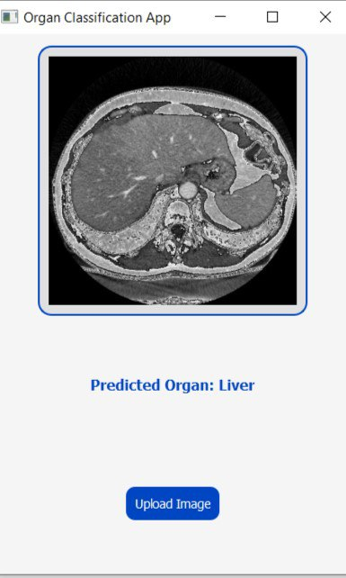

# Organ Classification AI Model

This project implements a convolutional neural network (CNN) to classify grayscale medical images of main organs into predefined categories: heart, brain, and liver. The project is built using TensorFlow and Keras and is suitable for researchers and practitioners in medical image analysis.

## Overview
This model takes grayscale medical images as input, processes them through a CNN, and outputs the predicted class (organ). It is trained on a dataset of organ images and achieves high accuracy in organ classification tasks.

## Dataset
The dataset is organized into three directories:
1. `Train`: Training dataset.
2. `Test`: Testing dataset.
3. `Validation`: Validation dataset.

All images are stored in grayscale format, resized to 180x180 pixels, and normalized to have pixel values between 0 and 1.

### Directory Structure
```
- Train
    - Heart
    - Brain
    - Liver
- Test
    - Heart
    - Brain
    - Liver
- Validation
    - Heart
    - Brain
    - Liver
```

## Model Architecture
The CNN model consists of:
- Three convolutional layers with ReLU activation and max-pooling for feature extraction.
- A dropout layer for regularization.
- A dense layer for feature aggregation.
- A softmax output layer for multi-class classification.

### Summary
- Input: 180x180x1 grayscale images.
- Output: 3 classes (heart, brain, liver).
- Loss Function: Categorical Crossentropy.
- Optimizer: Adam.
- Metrics: Accuracy.

## Training
The model is trained using the following parameters:
- **Batch Size**: 32
- **Epochs**: 10
- **Training Data Augmentation**: None

To start training:
```python
history = model.fit(data_train, validation_data=data_val, epochs=epochs_size)
```

## Evaluation
The trained model is evaluated on the test dataset:
```python
eval_loss, eval_acc = model.evaluate(data_test)
print(f"Test Accuracy: {eval_acc:.2f}")
```

## Prediction
To classify a new medical image:
1. Load the image in grayscale and resize it to 180x180 pixels.
2. Normalize pixel values to the range [0, 1].
3. Add a batch dimension.
4. Pass it to the model for prediction.

Example:
```python
image = load_img(image_path, target_size=(img_height, img_width), color_mode='grayscale')
img_arr = img_to_array(image) / 255.0
img_bat = tf.expand_dims(img_arr, axis=0)
predict = model.predict(img_bat)
```
# GUI Integration

A graphical user interface (GUI) has been implemented using PyQt5 to simplify the process of uploading an image and viewing its prediction. The GUI allows users to:

- Upload an image file using a file dialog.
- Display the uploaded image.
- Perform real-time prediction using the trained model.
- Show the predicted organ.

## Screen Shots 
  

## Usage
1. Clone the repository:
```bash
git clone https://github.com/MonaElkhouly/ AI Organs Image Classifier.git
cd organ-classification
```
2. Train the model:
```python
Oraganclassifier.py
```
3. Save the trained model:
```python
model.save('organ_classify.keras')
```

## Dependencies
- Python 3.7+
- TensorFlow 2.9+
- NumPy
- Pandas
- Matplotlib


## Acknowledgments
This project is inspired by the need for accurate and automated classification of medical images to assist healthcare professionals. The dataset used is publicly available on Kaggle.

