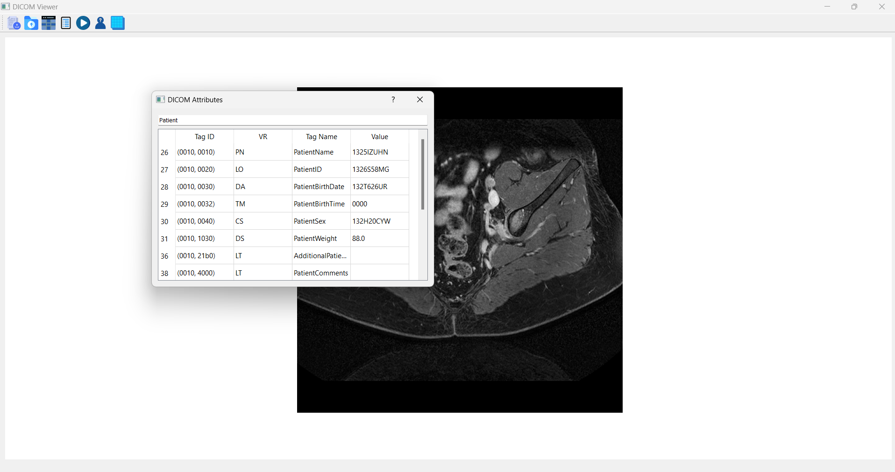

# DICOM Viewer

## Overview
The DICOM Viewer is a desktop application built using Python and PyQt5. It provides functionality for viewing, analyzing, and anonymizing DICOM files with 2D, M2D, or 3D images. The application offers intuitive controls for navigating through DICOM datasets and accessing key metadata.

---

## Features

### 1. File Support
- **Supported Formats**: The application can open any DICOM file containing 2D, M2D, or 3D images.

### 2. Image Display Modes
- **2D**: Displays single-frame 2D images.
- **M2D**: If a file contains multiple frames (M2D), it displays the images as a video.
- **3D**: Allows tile-based visualization of the slices for files containing 3D data.

### 3. Metadata Exploration
- **Complete DICOM Tags**: Display all DICOM tags present in the file along with their values.
- **Search Functionality**: Search for a specific DICOM tag and view its value.
- **Main DICOM Elements**: Provides quick access to the main DICOM groups (Patient, Study, Modality, Physician, and Image) via dedicated buttons in the main UI.

### 4. Anonymization
- Replace critical patient information with random values prefixed by a user-defined string. This ensures privacy and compliance with data security protocols.

### 5. Intuitive User Interface
- **Toolbar**: Includes actions for opening files, exploring tags, playing videos, toggling tiles, and anonymizing DICOM files.
- **Grid and Scroll Area**: Provides a tile-based view for browsing multiple slices within a folder or 3D volume.

---

## How to Use

### Opening Files
1. **Open a Single DICOM File**:
   - Click the "Open DICOM" button in the toolbar.
   - Select a DICOM file (.dcm) from your system.
2. **Open a DICOM Folder**:
   - Click the "Open DICOM Folder" button in the toolbar.
   - Select a folder containing DICOM files.

### Viewing Modes
- **Single Slice View**:
  - Displays one slice at a time for 2D images.
- **Video Mode**:
  - If the file contains multiple frames (M2D), click "Play Video" to toggle video playback.
- **Tile View**:
  - For 3D or multi-slice datasets, click "Show Tiles" to view all slices as tiles.

### Metadata Exploration
- Click "Show Attributes" to view all DICOM tags.
- Click "Show Details" to explore main DICOM elements (e.g., Patient, Study, etc.).
- Use the search bar in the attributes window to find specific tags.

### Anonymization
1. Open a DICOM file or folder.
2. Click the "Anonymize DICOM" button.
3. Enter a prefix when prompted. This prefix will be used to generate anonymized values for sensitive tags.
4. The anonymized file will be saved, overwriting the original.

### Toggle Views
- Use the "Show Tiles" button to switch between tile and single-slice views.

---

### Screenshots
#### Single Slice View


#### Tile View


## Video Demonstration of M2D

https://github.com/user-attachments/assets/5536912e-8efd-45fe-a155-6757185cdf08

## Requirements
- Python 3.6 or later
- Libraries:
  - PyQt5
  - pydicom
  - matplotlib
  - numpy

---

## Project Structure
- **Main Application**: Includes the GUI components and core logic for the viewer.
- **Canvas for Display**: Utilizes `matplotlib` for rendering 2D slices and video playback.
- **Grid Layout**: Manages tile-based visualization for 3D datasets.
- **Anonymization**: Provides functionality to anonymize critical DICOM tags.

---

## Future Enhancements
- Enhanced 3D visualization capabilities.
- Integration with machine learning models for advanced analysis.
- Support for additional DICOM modalities.

---
### Folder Structure
```
📂 DICOM Viewer
├── 📂 src
│   ├── fullversion.py       # Entry point of the application
├── 📂 Icons          # Icons, styles, and other assets
├── 📂 data_example    # The data shown in screenshots
└── README.md         # This file
```

## Acknowledgments
Special thanks to Dr.Tamer Basha, whose guidance and expertise have been invaluable in the development of this project. We deeply appreciate your support and insightful feedback, which have significantly enhanced the application's design and functionality.

Additionally, thanks to the open-source community for providing tools and libraries that made this project possible.


