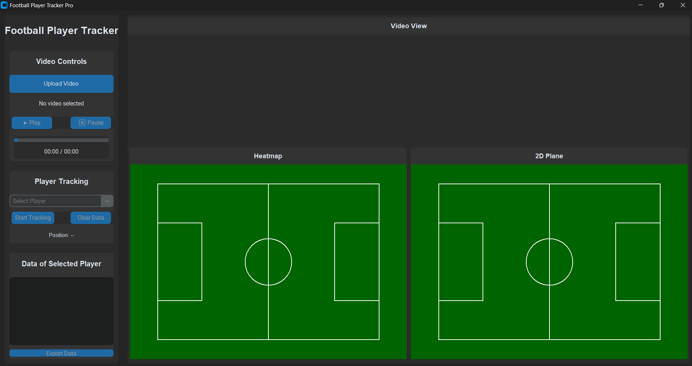

# Football Player Tracker


A sophisticated desktop application for tracking and analyzing football player movements in video footage using YOLO object detection and custom visualization tools.

## Features

- **Video Processing**
  - Upload and playback football match videos
  - Real-time player detection using YOLOv8
  - Smooth video controls (play, pause, progress tracking)
  - Frame-by-frame analysis capabilities

- **Player Tracking**
  - Automatic player detection and ID assignment
  - Individual player selection and tracking
  - Real-time position monitoring
  - Velocity calculations
  - Movement path visualization

- **Data Visualization**
  - Interactive 2D football pitch display
  - Real-time movement tracking visualization
  - Heat map generation for player positioning
  - Detailed player statistics display

- **Data Analysis**
  - Position tracking over time
  - Speed and movement patterns analysis
  - Export tracking data to CSV format
  - Comprehensive player statistics

## Prerequisites

Make sure you have the following installed:

- Python 3.8 or higher
- OpenCV (cv2)
- NumPy
- PIL (Python Imaging Library)
- CustomTkinter
- Ultralytics YOLO
- SciPy


## Usage

1. Start the application:
```bash
python FootballMatch_AITracker.py
```

2. Using the application:
   - Click "Upload Video" to select a football match video
   - Use the play/pause controls to control video playback
   - Select a player from the dropdown to track their movement
   - Toggle tracking to start/stop movement analysis
   - View real-time statistics and heat maps
   - Export tracking data when needed

## Features in Detail

### Video Controls
- Upload and play video files
- Play/Pause functionality
- Progress bar with time display
- Frame-by-frame processing capability

### Player Tracking
- Automatic player detection using YOLO
- Unique ID assignment to each player
- Individual player selection
- Real-time position tracking
- Movement path visualization

### Data Visualization
- 2D pitch representation
- Real-time movement tracking
- Heat map generation
- Statistical data display

### Analysis Tools
- Position tracking
- Velocity calculations
- Movement pattern analysis
- Data export functionality

## Technical Details

- Built with Python and CustomTkinter for modern UI
- Uses YOLOv8 for real-time player detection
- Implements efficient frame processing algorithms
- Features custom tracking algorithm for player identification
- Utilizes SciPy for heat map generation

## Acknowledgments

- YOLOv8 by Ultralytics
- CustomTkinter for the modern UI components
- OpenCV community for video processing capabilities
