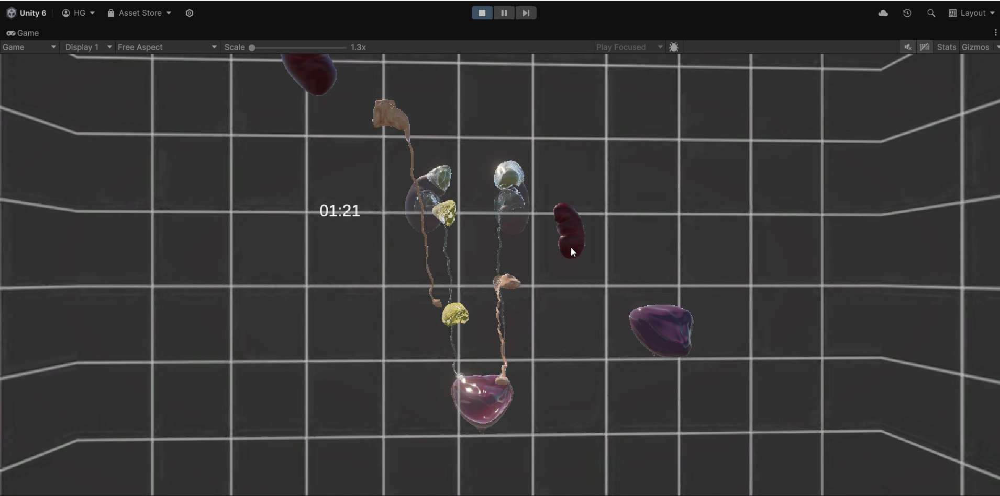

# 3D Urinary System Puzzle Game

## Overview
The **3D Urinary System Puzzle Game** is an interactive Unity-based game that allows players to assemble the urinary system in a 3D space. The game randomizes the positions and orientations of organ parts and challenges players to flip, rotate, drag, and drop them into their correct positions within a limited time.

---

### Video Demonstration

## Features

### 1. Randomization
- The game starts by scattering the parts of the urinary system randomly in 3D space.
- Each part is assigned a random orientation around all axes.

### 2. Interaction Mechanics
- Players can interact with the organ parts using the following controls:
  - **Flip along axes**: Use `Q/A`, `W/S`, `E/D` keys to rotate parts along the X, Y, and Z axes.
  - **Drag and drop**: Click and hold to drag parts; release to drop them.

### 3. Puzzle Assembly
- Players manually move and rotate parts to align them with their corresponding shadow shapes.
- Parts snap into place when they are close to their correct position and orientation, aligning perfectly with their target.

### 4. Timer
- A two-minute timer challenges players to complete the puzzle within the time limit.

---

## Scripts
The game is powered by the following scripts:

1. **DragAndDrop.cs**
   - Implements the drag-and-drop functionality for moving parts around the scene.

2. **Randomization.cs**
   - Randomly scatters the organ parts across the scene at the start of the game.

3. **RandomOrientation.cs**
   - Assigns each part a random orientation along the Y-axis at the start.

4. **Snapping.cs**
   - Checks for proximity between parts and their target positions.
   - Snaps parts into place when they are close enough, ensuring proper alignment.

5. **Timer.cs**
   - Tracks the remaining time and displays it to the player.
   - Ends the game if the timer reaches zero.

---

## How to Play
1. **Start the Game**:
   - Launch the application and press the start button to begin.

2. **Solve the Puzzle**:
   - Use the `Q/A`, `W/S`, and `E/D` keys to rotate the organ parts along the X, Y, and Z axes.
   - Drag and drop parts to position them.
   - Align parts with their corresponding shadows to snap them into place.

3. **Finish Within the Timer**:
   - Complete the assembly before the timer reaches zero.
   - If successful, the assembled urinary system is displayed as a 3D model.

---

## Controls
- **Rotate**:
  - `Q/A`: Rotate along the X-axis.
  - `W/S`: Rotate along the Y-axis.
  - `E/D`: Rotate along the Z-axis.
- **Drag and Drop**:
  - Left-click and hold to drag.
  - Release to drop.

---

## Acknowledgments
Special thanks to the Unity community for providing resources and tutorials that made this project possible.

